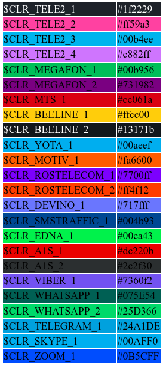

= A1S PlantUML Lib
:toc:
:sectnums:
:sectnumlevels: 5
:outlinelevels: 5
:sectids:

Библиотека тем и спрайтов A1S.

WARNING: Отказ от ответственности: все права принадлежат их владельцам. Данные получены из открытых источников и сети Интернет. Данная библиотека предоставляется в режиме AS-IS. Автор не несёт ответственности в случае ущерба, понесённого в результате использования данной библиотеки.

TIP: В случае, если у вас есть более качественная версия логотипа или более точная версия цвета, то можете создать MR (fork + pull request/merge request).

В телекоме и в области мобильной связи часто возникает необходимость в диагрммах, например, диаграммах прохождения трафика или каких-то даиграммах последовательностей.

Одним из лучших, если не самым лучшим инстурментом для рисования диаграмм и схем (в парадигде `diagram as a code`) является PlantUML ( https://plantuml.com/ ).

Кроме того, у данного инструмента есть множество интеграций с другими системами:

 * Confluence https://marketplace.atlassian.com/apps/41025/plantuml-for-confluence?tab=overview&hosting=datacenter
 * Intellij Idea https://plugins.jetbrains.com/plugin/7017-plantuml-integration
 * MS VS Code https://marketplace.visualstudio.com/items?itemName=jebbs.plantuml

Так как достаточно часто приходится рисовать диаграммы, то и появилась необходимость собрать часто используемые части/компоненты в виде библиотеки.

Например, очень не хватало логотипов операторов.

При использовании данной библиотеки можно строить диаграммы такого вида:

.Пример диаграммы с использованием библиотеки

В виде такого текстового описания:

.Пример текста для генерации диаграммы
[source,puml]
----
@startuml

title Схема прохождения трафика

!include https://raw.githubusercontent.com/wizardjedi/a1s-plantuml-lib/master/a1s-lib.puml

rectangle "<$megafon_s,scale=0.5,color=$CLR_MEGAFON_1>" as megafon
rectangle "<$mts_s,scale=0.5,color=$CLR_MTS_1>" as mts
rectangle "<$beeline_s,scale=0.5>" as beeline $CLR_BEELINE_1
rectangle "<$tele2_s,scale=0.5,color=$CLR_TELE2_1>" as tele2

rectangle "<$smstraffic_s,scale=0.5,color=$CLR_SMSTRAFFIC_1>\nSMS Traffic" as smstraffic
rectangle "<$devino_s,scale=0.5,color=$CLR_DEVINO_1>\nDevino Telecom" as devino

left to right direction

actor client

client --> smstraffic : smpp 50%
client --> devino : smpp 50%

smstraffic --> tele2
smstraffic --> mts $CLR_MTS_1
smstraffic --> megafon $CLR_MEGAFON_1
smstraffic --> beeline $CLR_BEELINE_1

devino --> tele2
devino --> mts $CLR_MTS_1
devino --> megafon $CLR_MEGAFON_1
devino --> beeline $CLR_BEELINE_1

@enduml
----

== Подключение

Для подключения библиотеки необходимо либо скачать библиотеку и использовать с локальной файловой системы или импортировать по URL.

.Пример подключения библиотеки по URL
[source,puml]
----
!include https://raw.githubusercontent.com/wizardjedi/a1s-plantuml-lib/master/a1s-lib.puml
----

WARNING: PlantUML имеет ограничения безопасности по импорту библиотек по URL. Настройки безопасности описаны на соответствующзей странице https://plantuml.com/security

=== Пример подключения для Confluence

Плагин PlantUML для Confluence может загружать файлы из приложений к страницам ( https://avono-support.atlassian.net/wiki/spaces/PUML/pages/9699367/Macro+plantuml ).

Для Confluence алгоритм подключения будет таким:

* Скачиваем файл с описанием библиотеки https://raw.githubusercontent.com/wizardjedi/a1s-plantuml-lib/master/a1s-lib.puml
* Для корневой (или какой-то другой страницы) добавляем файл `a1s-lib.puml` в приложения (attachment)
* В тексте диаграммы подключаем данный файл с помощью синтаксиса включения
+
----
^attachment.ext
pagetitle
pagetitle^attachment.ext
spacekey:pagetitle
spacekey:pagetitle^attachment.ext
----

== Цвета

=== Специальные цвета

=== Корпоративные цвета

Для логотипов компаний и сервисов были выделены корпоративные или цвета бренда. Такие цвета записаны в переменных вида `$CLR_<BRAND>_<НОМЕР>` (например, `$CLR_TELE2_1`).

[%header]
|===
|Переменная|Значение|Описание
|`$CLR_TELE2_1`|`#1f2229`|Теле2 РФ
|`$CLR_TELE2_2`|`#ff59a3`|Теле2 РФ
|`$CLR_TELE2_3`|`#00b4ee`|Теле2 РФ
|`$CLR_TELE2_4`|`#c882ff`|Теле2 РФ
|`$CLR_MEGAFON_1`|`#00b956`|Мегафон РФ
|`$CLR_MEGAFON_2`|`#731982`|Мегафон РФ
|`$CLR_MTS_1`|`#cc061a`|МТС РФ
|`$CLR_BEELINE_1`|`#ffcc00`|Билайн(Вымпелком) РФ
|`$CLR_BEELINE_2`|`#13171b`|Билайн(Вымпелком) РФ
|`$CLR_YOTA_1`|`#00aeef`|Йота РФ
|`$CLR_MOTIV_1`|`#fa6600`|Мотив РФ/Екатеринбург-2000
|`$CLR_ROSTELECOM_1`|`#7700ff`|Ростелеком
|`$CLR_ROSTELECOM_2`|`#ff4f12`|Ростеоеком
|`$CLR_DEVINO_1`|`#717fff`|Девино телеком
|`$CLR_SMSTRAFFIC_1`|`#004b93`|СМС Траффик
|`$CLR_EDNA_1`|`#00ea43`|ОСК/Эдна
|`$CLR_A1S_1`|`#dc220b`|А1 Системс
|`$CLR_A1S_2`|`#2c2f30`|А1 Системс
|`$CLR_VIBER_1`|`#7360f2`|Viber/Вайбер
|`$CLR_WHATSAPP_1`|`#075E54`|WhatsApp
|`$CLR_WHATSAPP_2`|`#25D366`|WhatsApp
|`$CLR_TELEGRAM_1`|`#24A1DE`|Telegram
|`$CLR_SKYPE_1`|`#00AFF0`|Skype
|`$CLR_ZOOM_1`|`#0B5CFF`|Zoom
|===

.Таблица корпоративных цветов для иллюстрации

WARNING: Цвета были получены из открытых источников. В частности с корпоративных сайтов с использованием инструмента CSS Overview из Chrome Developer Tools.

== Спрайты

.Пример использования спрайтов
----
card "<$beeline>" as beeline

rectangle "<$megafon,scale=0.5,color=$CLR_MEGAFON_1>" as megafon $CLR_MEGAFON_2
----

* Спрайты разбиты на группы
** `messengers` - мессенджеры
** `mobile-operators` - логотипы мобильных операторов
** `sms-agregators` - логотипы СМС-агрегаторов
** `vendors` - вендоры
* Для спрайтов приняты следюущие размеры, которые оформляются в виде суффиксов к имени файла
** `_s` - маленький, только логотип, размер `128px x 128px` (пример, `<$megafon_s>`)
** `_l` - большой, логотип с названием, максимальный размер по ширине `300px` (пример, `<$motiv_l>`)
* Исходные изображения для спрайтов сохранены в директориях `src` соответствующей директории с категориями

=== Вендоры

[%header]
|===
|Спрайт|Изображение|Размеры
|`<$a1s_l>` a|image::vendors/a1s_l.png[] | 300x105
|`<$a1s_s>` a|image::vendors/a1s_s.png[] | 128x128
|===

=== Мобильный операторы РФ

[%header]
|===
|Спрайт|Изображение|Размеры
|`<$beeline_l>` a|image::mobile-operators/beeline_l.png[]| 300x63
|`<$beeline_s>` a|image::mobile-operators/beeline_s.png[]| 128x128
|`<$megafon_l>` a|image::mobile-operators/megafon_l.png[]| 300x54
|`<$megafon_s>` a|image::mobile-operators/megafon_s.png[]| 128x128
|`<$motiv_l>` a|image::mobile-operators/motiv_l.png[]| 300x56
|`<$motiv_s>` a|image::mobile-operators/motiv_s.png[]| 128x128
|`<$mts_l>` a|image::mobile-operators/mts_l.png[]| 300x300
|`<$mts_s>` a|image::mobile-operators/mts_s.png[]| 128x128
|`<$rostelecom_l>` a|image::mobile-operators/rostelecom_l.png[]| 300x77
|`<$rostelecom_s>` a|image::mobile-operators/rostelecom_s.png[]| 128x128
|`<$sbermobile_l>` a|image::mobile-operators/sbermobile_l.png[]| 300x39
|`<$sbermobile_s>` a|image::mobile-operators/sbermobile_s.png[]| 128x128
|`<$tele2_l>` a|image::mobile-operators/tele2_l.png[]| 300x118
|`<$tele2_s>` a|image::mobile-operators/tele2_s.png[]| 128x128
|`<$tinkoff_l>` a|image::mobile-operators/tinkoff_l.png[]| 300x92
|`<$tinkoff_s>` a|image::mobile-operators/tinkoff_s.png[]| 136x128
|`<$yota_l>` a|image::mobile-operators/yota_l.png[]| 300x95
|`<$yota_s>` a|image::mobile-operators/yota_s.png[]| 128x128
|===

=== SMS-агрегаторы РФ

[%header]
|===
|Спрайт|Изображение|Размеры
|`<$devino_l>` a|image::sms-agregators/devino_l.png[] |300x115
|`<$devino_s>` a|image::sms-agregators/devino_s.png[] |128x128
|`<$edna_l>` a|image::sms-agregators/edna_l.png[] |300x93
|`<$edna_s>` a|image::sms-agregators/edna_s.png[] |128x128
|`<$rapporto_l>` a|image::sms-agregators/rapporto_l.png[] |300x77
|`<$rapporto_s>` a|image::sms-agregators/rapporto_s.png[] |128x128
|`<$smstraffic_l>` a|image::sms-agregators/smstraffic_l.png[] |300x50
|`<$smstraffic_s>` a|image::sms-agregators/smstraffic_s.png[] |128x128
|===

=== Instant Messengers

[%header]
|===
|Спрайт|Изображение|Размеры
|`<$skype_s>` a|image::messengers/skype_s.png[] | 128x128
|`<$telegram_s>` a|image::messengers/telegram_s.png[] | 128x128
|`<$viber_s>` a|image::messengers/viber_s.png[] | 128x128
|`<$whatsapp_s>` a|image::messengers/whatsapp_s.png[] | 128x128
|`<$zoom_s>` a|image::messengers/zoom_s.png[] | 128x128
|===

== Сборка

== Общий алгоритм к созданию спрайтов

[appendix]
== Частые вопросы
[qanda]
Почему картинки чёрные?:: Это связано с ограничениями PlantUML. На текущий момент можно использовать только спрайты в виде монохромных изображений, переведённые в текстовое описание см. https://plantuml.com/sprite